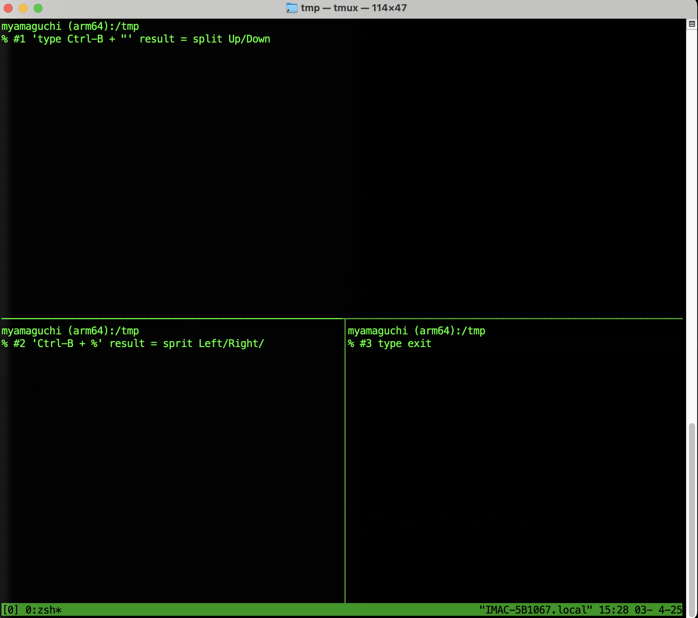

# UNIX/Linuxコマンドラインの基礎とターミナルマルチプレクサ

## 利用場面 (Use Case)

- SSHでアクセスしている時、セッションが切れて結果が失われることを防ぐ必要がある
- 括処理(batch)に慣れる。Shellスクリプトを利用して複数ファイルを対象に同様の繰り返し処理を効率的に行うための環境設定をする。

## Terminal 生活に必須の'screen'と'tmux'

UNIX系OS はGUI(Graphic User Interface)操作もできるがCUI (Command Line Interface)で操作することが多い。
そもそもサーバー管理の場面ではGUIなどない。

UNIX系OS操作はターミナルのクライアントソフトを操作し、ターミナルのサーバーが命令を実行する。
実行はローカル、リモートホストに差異は無い。

ローカルのターミナル操作に加えてクライアント・サーバー接続での利用も一般に行われる。

- クライアント <==> メモリややSOCKET通信 <==> クライアント
- クライアント <==> TCP/IP <==> サーバー

標準的・基本的なターミナルソフトにはいくつかの不便が存在する。これらの不便を解消するために、`screen`や`tmux`といったターミナルマルチプレクサが開発されました。

- 複数の作業を同時にしたいのに、ターミナルをいくつも開くのが面倒:
  - 複数の作業を並行して行いたい、複数の画面を参照したい
- 作業中にネットワークが切断されたら、作業が中断されてしまう:
  - SSHなどでリモートサーバーに接続して作業中に、ネットワークが途切れてしまう
- 作業を一時的に中断して、後で同じ状態から再開したい:
  - 長時間かかる作業を一時的に中断して、翌日に同じ状態から作業を再開したい

このTCPでの通信は不安定な場合もある。サーバー機能と接続中にTCPが途切れると処理が崩れやり直しになる。
そこで不安定なTCPでの通信下でも処理が復帰（Resume）できる便利なものが開発された。
現在はscreenとtmuxが生き残った。

- screen ：複数の同一形状画面(セッション)を参照できる機能
- tmux ：複数のセッションのみならず、ウインドウ切り替えと画面分割(ペイン)の機能

### tmux

[先達の素晴らしいtmux 紹介ページを参考](https://www.tohoho-web.com/ex/tmux.html)

- **基本的な起動**: `tmux` または `tmux new -s my_session`
- セッション操作
  - `CTRL-b d` でセッション中断(detach)
  - `tmux a` で中断セッションに戻る
- ウインドウ操作
  - `CTRL-b c`   あたらしいウインドウ作る
  - `CTRL-b n`   次のウインドウに移動する
  - `CTRL-b p`   前のウインドウに移動する
- ペイン操作
  - `CTRL-b "`  ペイン上下分割
  - `CTRL-b %`  ペイン左右分割

demoにて分割したりコピペしてみる。

### screen

[先達の素晴らしいscreen 紹介ページを参考](https://qiita.com/SAITO_Keita/items/b79ebc5af64aad28fc4a)

- **基本的な起動**: `screen` または `screen -S my_session`
まずは~/.screenrc に最低限の設定をしておく（おすすめはバインドキーをCTRL-Zにする）

dot.screenrc を参考に設定を変更することを勧める。
とくに'hardstatus'の設定は、現在のセッション名やウィンドウ番号を表示し、ウインドウ迷子にならぬよう、必須な設定。

## Let's えんしゅう

演習として下記を行う

- screen, tmux を起動してみる
- screen で複数セッションの起動/切り替えを経験する
- tmux に複数セッションの起動/切り替えを経験する
- tmux ではさらにペインという分割が経験できる

dot.screenrc を参考に設定すると良い。
