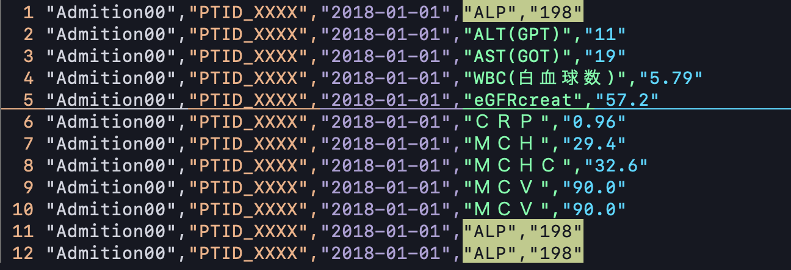
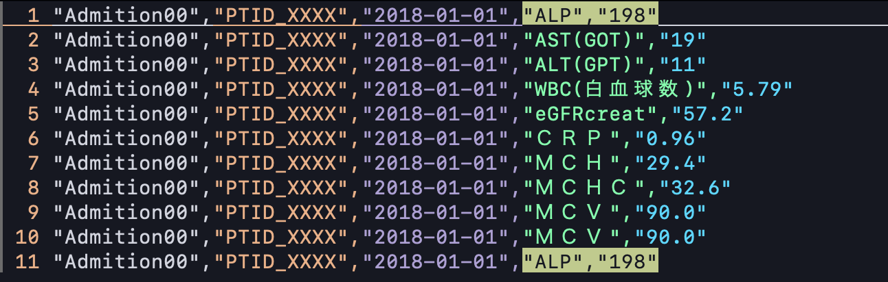

# 重複レコードに対する処理について

## 利用場面 (USE CASE)

フラットファイル（CSVやTSVなど）でデータを得ることが多い場面で、ファイル内に重複レコードが存在することがあります。これらのスクリプトは、重複を除いて正しい集計や分析を可能にするために利用されます。

### 重複のパターンに注意する

おおよそ次の4パターンがあります。

-   **A: 同一レコードが連続して重複が発生**
-   **B: 同一レコードが不連続に発生して重複する**

また、

-   **C: 同一ファイル内での重複**
-   **D: 複数ファイルに跨る重複**

などにも注意が必要です。

## 標準コマンドの利用と注意点

Unix/Linuxの標準コマンドである `uniq` は、隣接する重複行しか処理しないため、ファイル全体から重複を除去するには `sort | uniq` のようにパイプで `sort` コマンドと組み合わせる必要があります。

`uniq ClinicalExamSampleNotSorted.csv | wc -l`
`sort ClinicalExamSampleNotSorted.csv | uniq | wc -l`

`awk` や Python のような「連想配列（ハッシュマップ）」機能を持つ言語を利用することで、ファイルのソートなしに重複処理を行うことができます。

## スクリプト一覧と機能説明

このディレクトリには、重複レコードの処理に関連する以下のスクリプトが含まれています。

### AWKスクリプト

*   **`unique_lines.awk`**
    *   **機能**: 入力から重複する行を除外し、最初に出現したユニークな行のみを順序を保持して出力します。`awk '!a[$0]++'` というイディオムを使用しています。
    *   **使用例**: `cat input.txt | awk -f unique_lines.awk`

### Pythonスクリプト

*   **`process_lines.py`**
    *   **機能**: 複数のファイルから、ユニークな行を抽出するか、または重複している行のみを抽出する汎用スクリプトです。
    *   **オプション**:
        *   デフォルト: ユニークな行を順序を保持して抽出。
        *   `--no-order`: ユニークな行を抽出しますが、順序は保持せず、より高速に処理します。
        *   `--duplicates-only` (`-d`): 重複している行のみを抽出します。
    *   **使用例**:
        *   `python process_lines.py file1.txt file2.txt` (ユニーク行、順序保持)
        *   `python process_lines.py --no-order file1.txt` (ユニーク行、順序なし)
        *   `python process_lines.py -d file1.txt file2.txt` (重複行のみ)

### Shellスクリプト

*   **`checkDUP.sh`**
    *   **機能**: 事前に定義されたCSVファイルリストに対して、`sort | uniq | wc -l` と `gawk '!a[$0]++' | wc -l` を用いてユニーク行数をカウントし、結果を表示します。ファイルが存在しない場合は警告を出力します。
    *   **使用例**: `./checkDUP.sh`

---